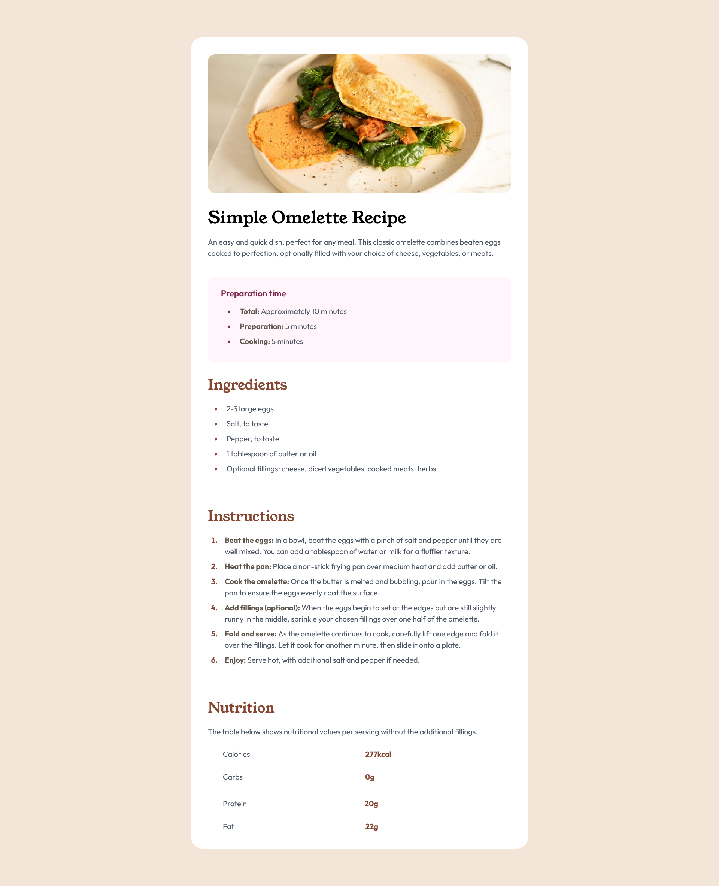

# Frontend Mentor - Recipe page solution

This is a solution to the [Recipe page challenge on Frontend Mentor](https://www.frontendmentor.io/challenges/recipe-page-KiTsR8QQKm). Frontend Mentor challenges help you improve your coding skills by building realistic projects. 

## Table of contents

- [Overview](#overview)
  - [The challenge](#the-challenge)
  - [Screenshot](#screenshot)
  - [Links](#links)
- [My process](#my-process)
  - [Built with](#built-with)
  - [What I learned](#what-i-learned)
  - [Continued development](#continued-development)
  - [Useful resources](#useful-resources)
- [Author](#author)
- [Acknowledgments](#acknowledgments)


## Overview

### The challenge

#### struggled with HSL,google fonts while working with Tailwind CSS

  As newbie to tailwind CSS i struggled with those two things while doing this challenge in Tailwind CSS.

#### Solution

  Fortunately for me my friend and also teammate yogesh(@yogesh-stack-dev) guided me through this.
  
  1.I just converted HSL TO HEX and used them.
  2.Through help i get the hang of using google fonts.

#### Example:

  ```javascript
      //tailwind.config.js

      module.exports = {
      content: ["*.{html,js}"],
      theme: {
      fontFamily:{
        'custom':['young serif'],
        'custom1':['outfit'],
      }
      },
      plugins: [],
      }

  ```


### Screenshot




### Links

- Solution URL: [solution](https://your-solution-url.com)
- Live Site URL: [https://recipe-page-xi-plum.vercel.app](https://recipe-page-xi-plum.vercel.app)

## My process

### Built with

- Semantic HTML5 markup
- CSS custom properties
- Flexbox
- [Tailwinscss](https://www.tailwindcss.com)


### What I learned

  I learned few things,one of them is an elements for bullet points and numbers. 

  Snippets of what i learned:

  ```html
        <ul class="list-disc ml-7 text-[#854632] font-custom1">
          <li class="pl-3 pb-2 "><span class="text-gray-600">2-3 large eggs </span> <br></li>
          <li class="pl-3 pb-2 "><span class="text-gray-600">Salt, to taste </span><br></li>
          <li class="pl-3 pb-2 "><span class="text-gray-600">Pepper, to taste </span><br></li>
          <li class="pl-3 pb-2 "><span class="text-gray-600">1 tablespoon of butter or oil </span><br></li>
          <li class="pl-3 pb-2 "><span class="text-gray-600">Optional fillings: cheese, diced vegetables, cooked meats, herbs </span><br></li>
        </ul>
  ```


### Continued development

  
During this HTML and Tailwind CSS project, I've identified key areas to enhance my skills:

1. **HTML Mastery:**
   - Deepening understanding for creating structured and meaningful content.

2. **Tailwind CSS Proficiency:**
   - Strengthening skills in efficient styling and responsive design.

3. **Responsive Design:**
   - Enhancing expertise in creating responsive layouts for diverse devices.

4. **Git for Version Control:**
   - Integrating version control using Git for effective project management and collaboration.

5. **Documentation Practices:**
   - Improving documentation to enhance code readability and collaboration.

These targeted areas reflect my commitment to continuous improvement within the realm of HTML and Tailwind CSS. I look forward to applying these refined skills in upcoming projects.

### Useful resources

  - [Html and css resouce:1](https://htmlandcssguidebook.com/) - This helped me for refering and rework. I really liked this pattern and will use it going forward.
  - [Css Flexbox resource:2](https://htmlandcssguidebook.com/) - This helped me for responsive design specific to flexbox.
  - [Tailwind resource:3](https://tailwindcss.com) - This is an tailwind documentation and this is enough to get better at this skill. I'd recommend it to anyone still learning this concept.


## Author

- Website - [Ayathulla](https://www.your-site.com)
- Frontend Mentor - [@Ayath2555](https://www.frontendmentor.io/profile/Ayath2555)


## Acknowledgments

  I am very thankful to my teammate yogesh(@yogesh-stack-dev) who helped me to complete this project.
  I am eagerly waiting for future collaboration and team work.